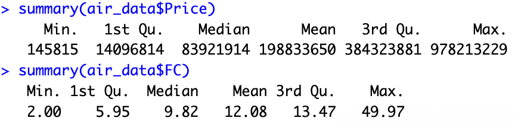
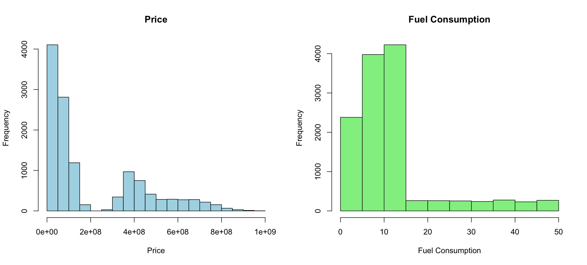
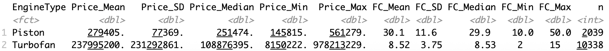
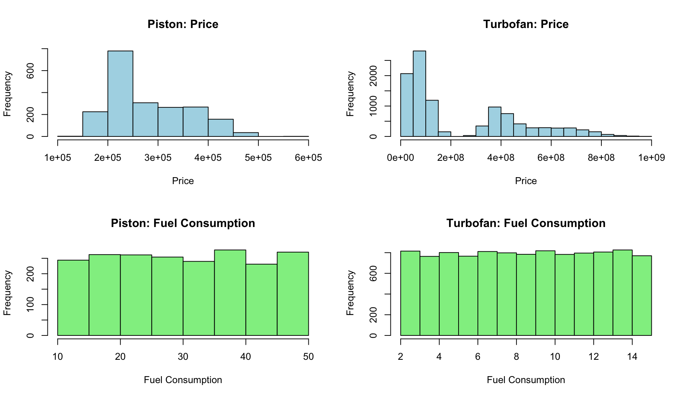
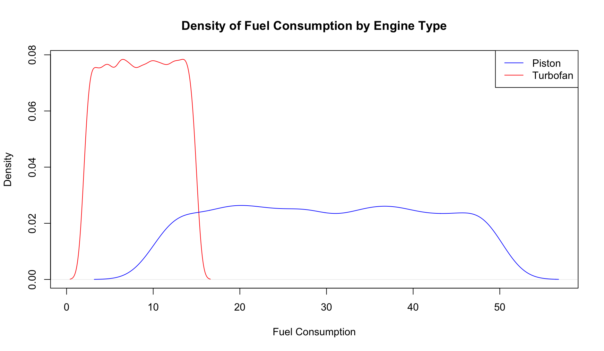
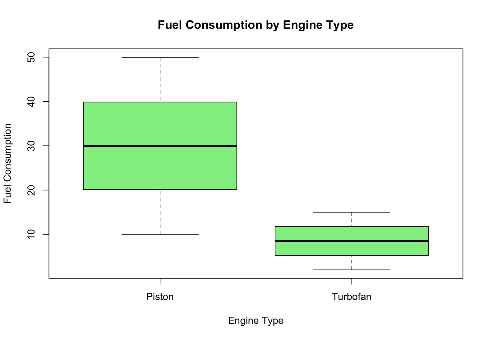
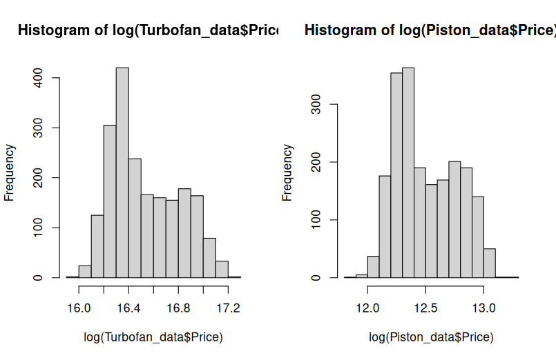
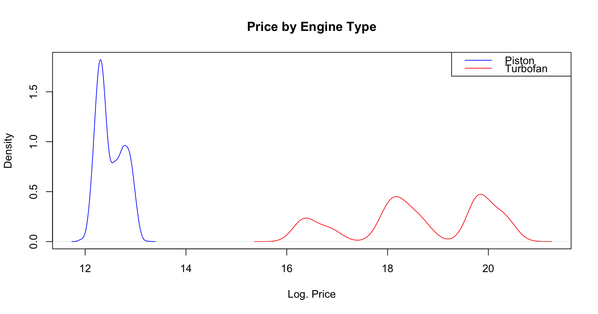
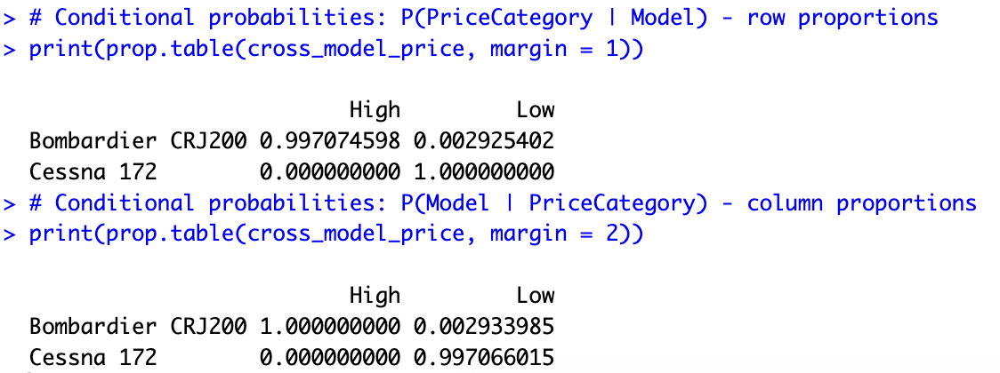
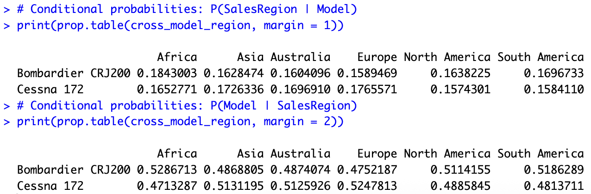

# Q1 Solutions

## Import data set to R assigning the type of each variable correctly

```r
air_data <- read.csv("./data/airplane_price_dataset.csv", sep=",", stringsAsFactors=TRUE)

air_data <- air_data %>%
  rename(
    FC = FuelConsumption.L.h.,
    HM = HourlyMaintenance...,
    Price = Price...
  )
air_data$EngineType <- as.factor(air_data$EngineType)

str(air_data)
```


## Summarize the variables Price, Fuel Consumption first for the all data and then for the groups of Engine Type

#### Total summary


*Figure 1.1*


*Figure 1.2*

#### Summary by Model


*Figure 2.1*


*Figure 2.2*


## Test whether Fuel Consumption is affected from the Engine Type of the plane. Check the assumptions and visualize the relationship between these two characteristics

#### Comparing distributions


*Figure 03*

#### Boxplot is best for comparing a continuous variable across categories


*Figure 04*


*Figure 05*

#### Conclusion

Since the p-value is < 0.05, we reject the null hypothesis and conclude there is a significant difference in mean fuel consumption between the engine types.

#### Test assumptions

- We checked for normality (Shapiro-Wilk) and homogeneity of variances (Levene's test). Because the sample size is large (N > 5000), the normality test is overly sensitive, but the large sample size allows us to rely on the Central Limit Theorem.
- Variance was addressed by using the default robust t-test in R (Welch's t-test).


## Construct 95% confidence intervals for the mean of two groups and interpret them

- We are 95% confident that the true population mean of FC for Piston engines lies within that interval **(29.61919, 30.62560)**.
- Similarly, the 95% CI for Turbofan is **(8.443816, 8.588554)**.

The two intervals do NOT overlap, this provides visual evidence that the mean Fuel Consumption differs significantly between the two engine types.


## Check the association between Model and Sales Region in the whole sample using proper method and interpret your findings

```r
table_model_region <- table(air_data$Model, air_data$SalesRegion)
chisq_result <- chisq.test(table_model_region)
print(chisq_result)
```

#### Conclusion

The p-value > 0.05 (~0.73), so we fail to reject the null hypothesis and conclude there is no statistically significant association between Model and Sales Region. The airplane models are distributed similarly across sales regions.


## Filter your data only considering Bombardier CRJ200 and Cessna 172 model airplanes

```r
filtered_air_data <- air_data |>
  filter(Model %in% c("Bombardier CRJ200", "Cessna 172")) |>
  droplevels()

str(filtered_air_data)
summary(filtered_air_data)
```


## Check the distribution of Price across two categories of Engine type (You can apply transformation if you think it is required)


*Figure 06*


*Figure 07*


#### Conclusion

- We applied a log() transformation to Price to correct for positive (right) skewness and better approximate a normal distribution.
- We can conclude that there is a significant different of Price between the two types of Engines.


## Categorize the variable Price into two categories as “Low” and “High” by cutting from the median and save it as a new variable into your data frame

```r
median_price <- median(filtered_air_data$Price, na.rm = TRUE)
# Create the new categorical variable "Price_Category"
filtered_air_data$Price_Category <- factor(
  ifelse(filtered_air_data$Price > median_price, "High", "Low")
)
```


## Cross classify model and price categories and interpret the conditional probabilities


*Figure 08*

#### Interpretation of Conditional Probabilities

- Row proportions P(PriceCategory | Model) show, for each model, what proportion of its airplanes fall into "Low" vs "High" price. Since Bombardier CRJ200 (Turbofan) has much higher prices than Cessna 172 (Piston), we expect nearly all Bombardier CRJ200 to be in the "High" category and nearly all Cessna 172 to be in the "Low" category.
- Column proportions P(Model | PriceCategory) show, for each price category, what proportion belongs to each model. The "Low" category is dominated by Cessna 172 and the "High" category by Bombardier CRJ200, so it confirms a strong association between airplane model and price level.


## Is there an association between the model of the airplane and its price level. Analyze it by using proper statistical method

```r
# Test association between Model and Price Level using Chi-Square
test_model_price <- chisq.test(cross_model_price)
print(test_model_price)
```

#### Conclusion

The p-value < 0.05, so we reject the null hypothesis and conclude there is a statistically significant association between airplane model and price level. Given that Bombardier CRJ200 (Turbofan) costs millions while Cessna 172 (Piston) costs hundreds of thousands, we expect a very small p-value, confirming a strong association.


## Cross classify the variables Model and Sales region. Interpret the conditional probabilities and then test whether there is an association between these two characteristics


*Figure 09*

#### Interpretation of Conditional Probabilities

- P(SalesRegion | Model) (row proportions): shows the distribution of sales regions for each model. Both models have similar proportions across regions, so we conclude that the sales region is independent of the model.
- P(Model | SalesRegion) (column proportions): shows, within each region, what share belongs to each model. Both models appear in roughly equal proportions within every region, so this supports our independence assumption.

#### Conclusion

As expected, p-value > 0.05 (~0.29), so we fail to reject the null hypothesis and conclude there is no significant association. The two models are sold in similar proportions across regions.
