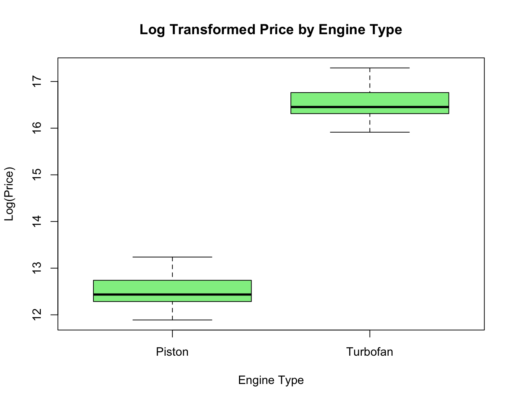

# Q1 Solutions

## Import data set to R assigning the type of each variable correctly

```r
air_data <- read.csv("./data/airplane_price_dataset.csv", sep=",", stringsAsFactors=TRUE)

air_data <- air_data %>%
  rename(
    FC = FuelConsumption.L.h.,
    HM = HourlyMaintenance...,
    Price = Price...
  )
air_data$EngineType <- as.factor(air_data$EngineType)

str(air_data)
```


## Summarize the variables Price, Fuel Consumption first for the all data and then for the groups of Engine Type

```r
air_data[, c("Price", "FC")] %>%
  summarize(
    Mean_Price = mean(Price, na.rm = TRUE),
    Median_Price = median(Price, na.rm = TRUE),
    SD_Price = sd(Price, na.rm = TRUE),
    Mean_Fuel = mean(FC, na.rm = TRUE),
    Median_Fuel = median(FC, na.rm = TRUE),
    SD_Fuel = sd(FC, na.rm = TRUE)
  )
hist(air_data$Price)
hist(air_data$FC)
```

#### Total summary

|     | Mean_Price | Median_Price | SD_Price  | Mean_Fuel | Median_Fuel | SD_Fuel  |     |
| --- | ---------- | ------------ | --------- | --------- | ----------- | -------- | --- |
|     | 198833650  | 83921914     | 229039179 | 12.07562  | 9.82        | 9.905418 |     |


*Figure 01*

#### Summary by Model

| EngineType | Mean_Price  | Median_Price | SD_Price    | Mean_Fuel | Median_Fuel | SD_Fuel |
| ---------- | ----------- | ------------ | ----------- | --------- | ----------- | ------- |
| Piston     | 279405.0    | 251474.0     | 77369.0     | 30.1      | 29.9        | 11.6    |
| Turbofan   | 237995200.0 | 108876395.0  | 231292861.0 | 8.52      | 8.53        | 3.75    |


*Figure 02*


*Figure 03*


## Test whether Fuel Consumption is affected from the Engine Type of the plane. Check the assumptions and visualize the relationship between these two characteristics

#### Boxplot is best for comparing a continuous variable across categories


*Figure 04*


*Figure 05*

#### Conclusion

Since the p-value is < 0.05, we reject the null hypothesis and conclude there is a significant difference in mean fuel consumption between the engine types.

#### Test assumptions

> We checked for normality (Shapiro-Wilk) and homogeneity of variances (Levene's test). Because the sample size is large (N > 5000), the normality test is overly sensitive, but the large sample size allows us to rely on the Central Limit Theorem.
> Variance was addressed by using the default robust t-test in R (Welch's t-test).


## Construct 95% confidence intervals for the mean of two groups and interpret them

**95% CI for Turbofan Fuel Consumption**: (8.443816, 8.588554)
> *We are 95% confident that the true population mean of fuel consumption for TurboFan falls between (8.443816, 8.588554)*

**95% CI for Piston Fuel Consumption**: (29.61919, 30.62560)
> *We are 95% confident that the true population mean of fuel consumption for Piston falls between (29.61919, 30.62560)*


## Check the association between Model and Sales Region in the whole sample using proper method and interpret your findings

```r
table_model_region <- table(air_data$Model, air_data$SalesRegion)
chisq_result <- chisq.test(table_model_region)
print(chisq_result)
```

#### Conclusion

Since both variables are categorical, a Chi-Square test is used. The p-value is ~0.7 (p > 0.05), meaning we fail to reject the null hypothesis and conclude there is no significant association between airplane model and sales region.


## Filter your data only considering Bombardier CRJ200 and Cessna 172 model airplanes

# TODO: image here instead

| Mean_Price | Median_Price | SD_Price  | Mean_Fuel | Median_Fuel | SD_Fuel |
| ---------- | ------------ | --------- | --------- | ----------- | ------- |
| 8033685.0  | 9221878.0    | 8374538.0 | 19.24929  | 13.655      | 13.8377 |


## Check the distribution of Price across two categories of Engine type (You can apply transformation if you think it is required)


*Figure 07*

> We applied a log() transformation to Price to correct for positive (right) skewness and better approximate a normal distribution.


## Categorize the variable Price into two categories as “Low” and “High” by cutting from the median and save it as a new variable into your data frame

```r
median_price <- median(filtered_air_data$Price, na.rm = TRUE)
# Create the new categorical variable "Price_Category"
filtered_air_data$Price_Category <- factor(
  ifelse(filtered_air_data$Price > median_price, "High", "Low")
)
```


## Cross classify model and price categories and interpret the conditional probabilities

```r
# Cross classify model and price categories
cross_model_price <- table(filtered_air_data$Model, filtered_air_data$Price_Category)

cat("\nCross Classification Table (Counts):\n")
print(cross_model_price)
cat("\nConditional Probabilities (Row proportions):\n")
print(prop.table(cross_model_price, margin = 1))
cat("\nConditional Probabilities (Column proportions):\n")
print(prop.table(cross_model_price, margin = 2))
```

| Model             | High Price Prob    | Low Price Prob |
| ----------------- | ------------------ | -------------- |
| Bombardier CRJ200 | 0.99707459         | 0.002925402    |
| Cessna 172        | 0                  | 1              |

#### Conclusion

The conditional probabilities show that if the airplane is a Bombardier CRJ200, there is an approximate 99.7% chance its price falls into the "High" category. Conversely, if the airplane is a Cessna 172, there is a 100% probability that its price is categorized as "Low".


## Is there an association between the model of the airplane and its price level. Analyze it by using proper statistical method

```r
# Test association between Model and Price Level using Chi-Square
test_model_price <- chisq.test(cross_model_price)
print(test_model_price)
```

#### Conclusion

The p-value < 2.2e-16 so there is a significant association between the airplane model and its price level.


## Cross classify the variables Model and Sales region. Interpret the conditional probabilities and then test whether there is an association between these two characteristics

```r
cat("\nCross Classification - Model and Sales Region:\n")
cross_model_region <- table(filtered_air_data$Model, filtered_air_data$SalesRegion)
print(cross_model_region)

cat("\nConditional Probabilities (Row proportions):\n")
print(prop.table(cross_model_region, margin = 1))

# Test for association
test_model_region <- chisq.test(cross_model_region)
print(test_model_region)
```

#### Interpretation of Conditional Probabilities

The row proportions indicate the likelihood of each model being sold in a specific region. For example, it shows the percentage of Bombardier CRJ200s sold in 'Europe' vs 'North America', mapping the distribution of sales regions given a specific airplane model.

#### Conclusion

The Chi-Square test yields a p-value of ~0.2895, so we fail to reject the null hypothesis, concluding there is no significant association between the airplane model and its sales region in this filtered subset.