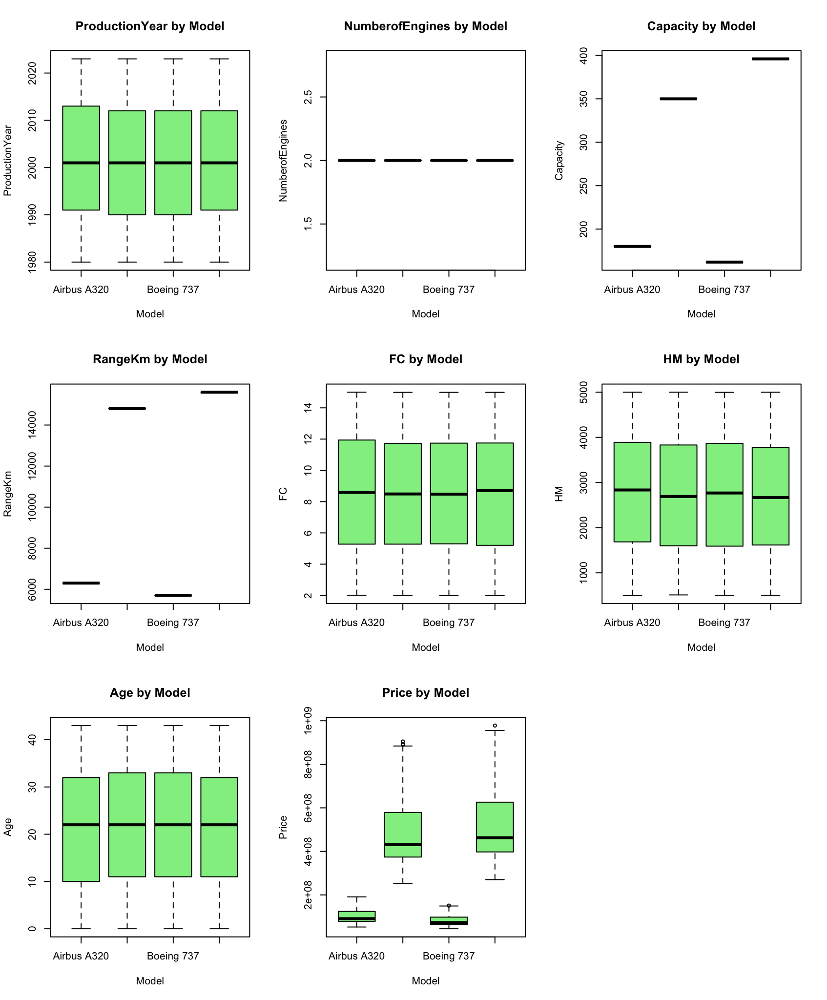

## Q2 Solutions

Import “airplane price data set” into R. The data set consists of following variables: Model, Production Year, Number of Engines, Engine Type, Capacity, Range (km), Fuel Consumption, Hourly Maintenance, age, Sales Region and Price of different airplanes.

#### Libraries

```r
library(tidyverse)
library(dplyr)
library(car)
```


#### Create a new data frame only including “Airbus A320”, “Airbus A350”, “Boeing 737” and “Boeing 777” models of airplanes. Checked the distribution of Price first for the observations in this sample and then for each model in the data frame. Interpret your findings.

```r
air_data <- read.csv("../data/airplane_price_dataset.csv", sep=",", stringsAsFactors=TRUE)
air_data <- air_data |>
  filter(Model %in% c("Airbus A320", "Airbus A350", "Boeing 737", "Boeing 777")) |>
  droplevels()
air_data <- air_data |>
  rename(
    FC = FuelConsumption.L.h.,
    HM = HourlyMaintenance...,
    RangeKm = Range.km.,
    Price = Price...
  )
air_data$EngineType <- as.factor(air_data$EngineType)

str(air_data)
```

#### ... TODO


#### Analyze the numerical variables that are affected by the “Model”. Test the assumptions of the statistical method, for the cases that you have found a significant association, by using corresponding tests and plots. Write your conclusions.

```r
str(air_data)

# Numerical vars only
num_vars <- names(air_data)[sapply(air_data, is.numeric)]
par(mfrow = c(3, 3))
for (var in num_vars) {
  boxplot(air_data[[var]] ~ air_data$Model,
          main = paste(var, "by Model"),
          xlab = "Model", 
          ylab = var,
          col = "lightgreen")
}
par(mfrow = c(1, 1))
```


*Figure 01*

Based on the boxplots, variables **Capacity**, **RangeKm** and **Price** are the ones affected by **Model**. We are selecting those 3 to do further analysis.

###### Test assupmtions

# Q-Q Plot
qqPlot(aov_price$residuals, main="Q-Q Plot for Residuals")
# Shapiro-Wilk test
shapiro.test(aov_price$residuals)

leveneTest(Price ~ Model, data = air_data)