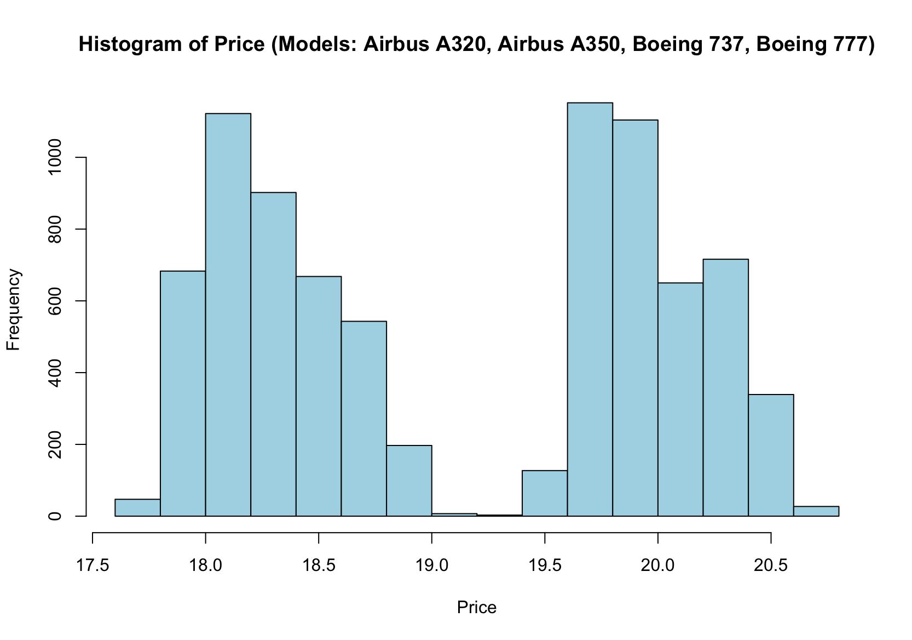
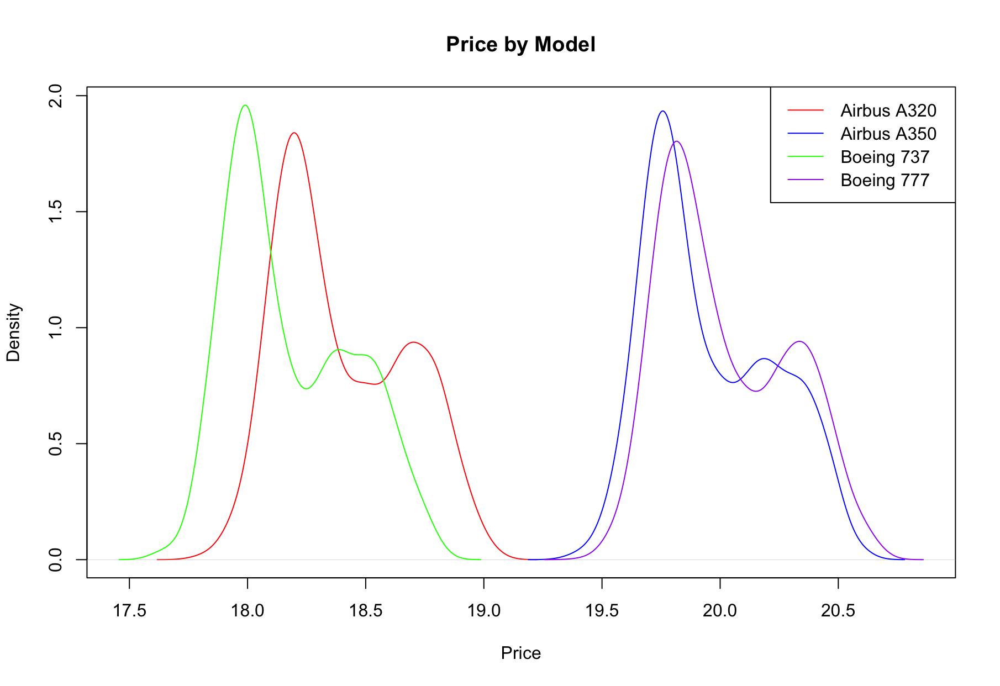
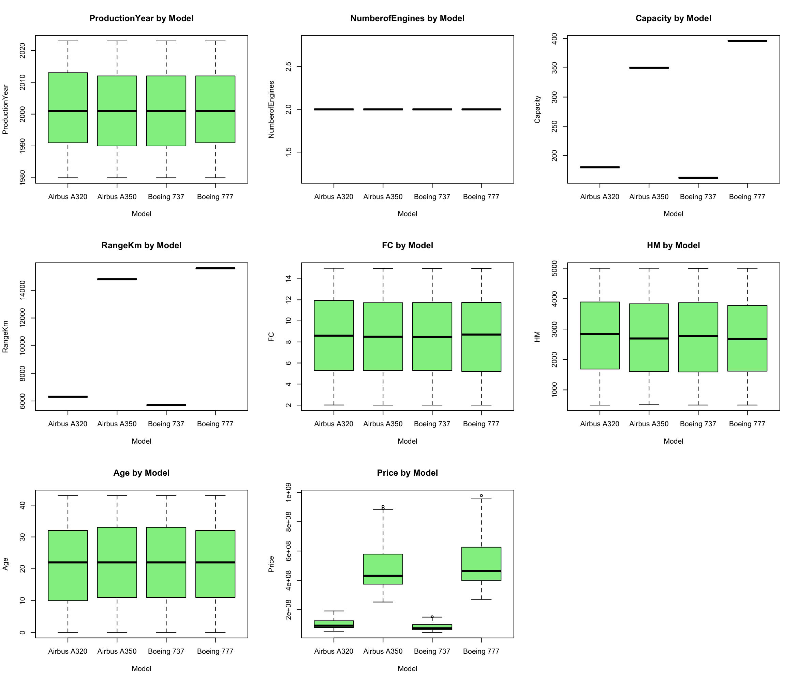
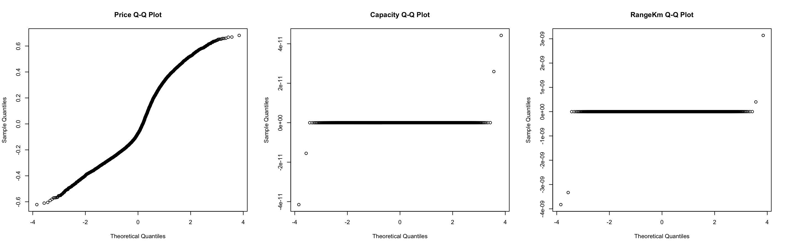
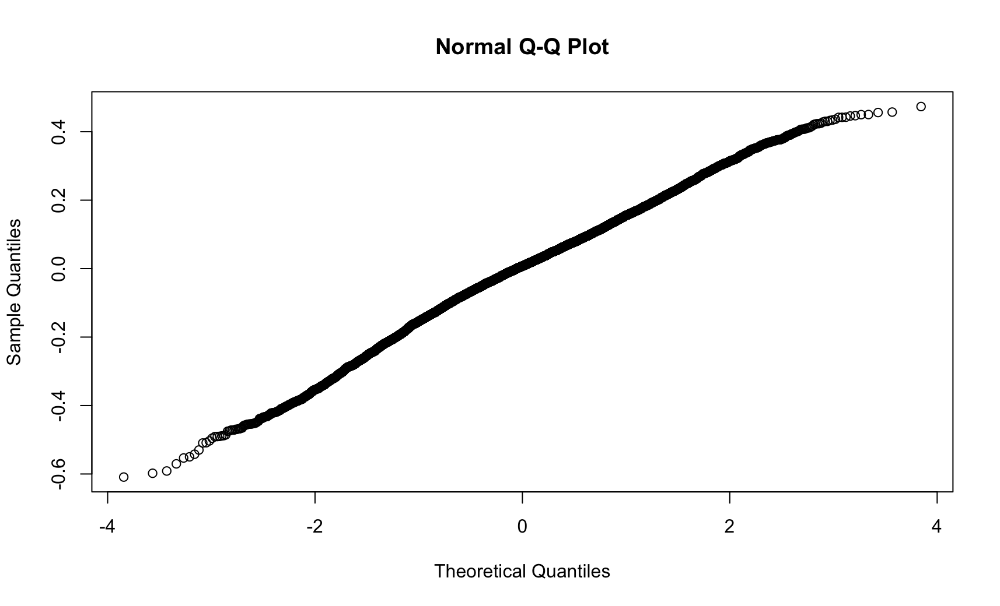
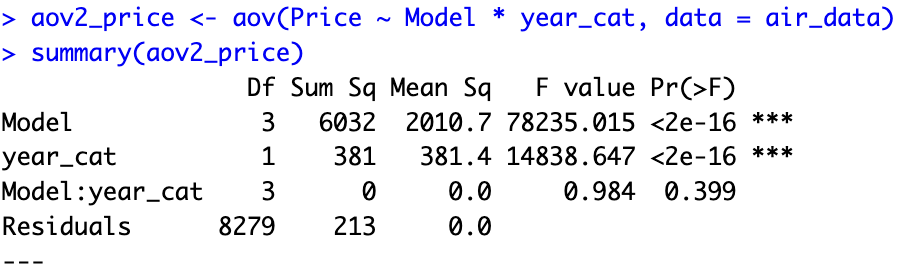

# Q2 Solutions

## Create a new data frame only including “Airbus A320”, “Airbus A350”, “Boeing 737” and “Boeing 777” models of airplanes. Check the distribution of Price: first for the observations in this sample and then for each model in the data frame. Interpret your findings.

```r
air_data <- read.csv("../data/airplane_price_dataset.csv", sep=",", stringsAsFactors=TRUE)
air_data <- air_data |>
  filter(Model %in% c("Airbus A320", "Airbus A350", "Boeing 737", "Boeing 777")) |>
  droplevels()
air_data <- air_data |>
  rename(
    FC = FuelConsumption.L.h.,
    HM = HourlyMaintenance...,
    RangeKm = Range.km.,
    Price = Price...
  )
air_data$EngineType <- as.factor(air_data$EngineType)
# Price is generally right-skewed data; a log() transformation helps to normalize the data
air_data$Price <- log(air_data$Price)
```


*Figure 01*


*Figure 02*

 According to the plots, Price looks more normally distributed after applying a log() transformation and also dividing it by model.
 A320 and B737 are the cheaper plane models of each company while A350 and B777 are the more expensive ones.


## Analyze the numerical variables that are affected by the “Model”. Test the assumptions of the statistical method, for the cases that you have found a significant association, by using corresponding tests and plots. Write your conclusions.


*Figure 03*

Based on the boxplots, variables **Price**, **Capacity**, and **RangeKm** are the ones affected by **Model**. We are selecting those 3 to do further analysis.

#### Assumption analysis


*Figure 04*

According to the QQ-plot, **Price** looks a bit curved with respect to the line meaning it might not be normally distributed.
This could mean that newer plane prices skew the data ?? or that another factor is affecting the data ???

For the case of **Capacity** and **RangeKm**, the QQ-plot show a horizontal flat line, meaning the data is not normally distributed.

In any case ANOVA is not the right test to apply in these cases and further analysis is required.


## Apply a two-way ANOVA including Sales Region to the model. Interpret your findings.

```r
aov2_price <- aov(Price ~ Model * SalesRegion, data = air_data)
summary(aov2_price)
aov2_capacity <- aov(Capacity ~ Model * SalesRegion, data = air_data)
summary(aov2_capacity)
aov2_range <- aov(RangeKm ~ Model * SalesRegion, data = air_data)
summary(aov2_range)
```

**Region** does not seem to influence any of the 3 numeric variables affected by **Model**.


## Convert the variable Production Year to a categorical variable with two levels as “Older” and “Newer” and save it as a new variable named “year_cat” in the data frame.

```r
cutoff = median(air_data$ProductionYear)
air_data$year_cat <- as.factor(ifelse(air_data$ProductionYear < cutoff, "Older", "Newer"))
str(air_data)
```


## Analyze the effect of Model and year (“year_cat”) together on the price. Analyze whether the interaction of two term is significant. Interpret your findings.


*Figure 05*

This first plot aligns with previous analysis, there are two cheaper plane models and two expensive ones, and now we observe that there are older and newer models also which are a bit more expensive (shifted to the right) in each case.

```r
aov2_price <- aov(Price ~ Model * year_cat, data = air_data)
summary(aov2_price)

# Test normality assumption for Two-Way ANOVA
qqnorm(aov2_price$residuals)
shapiro.test(residuals(aov2_price))
# Observations within each sample must be independent
dwtest(aov2_price, alternative ="two.sided")
# Populations from which the samples are selected must have equal variances (homogeneity of variance)
bptest(aov2_price)
```


*Figure 06*

Model and year_cat interaction look to adjust to the assumptions, so an ANOVA test could be the right one. 


*Figure 07*

According to the output:
- Model affects the Price
- year_cat affects the Price
- both Model and year_cat interaction do not seem to affect Price.

Maybe we could create another category (Economic and Premium) and do more analysis ???

# iii) Do not forget to do multiple comparisons tests! Apply post hoc tests to see where the differences source from. Apply three different post hoc tests and compare their findings.