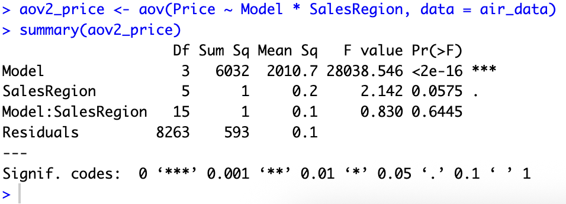
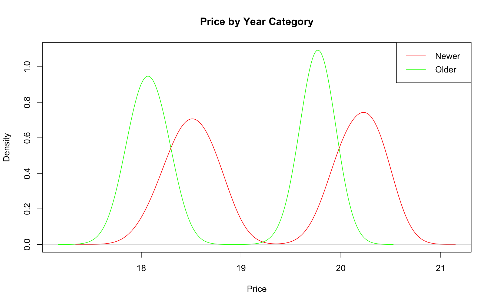
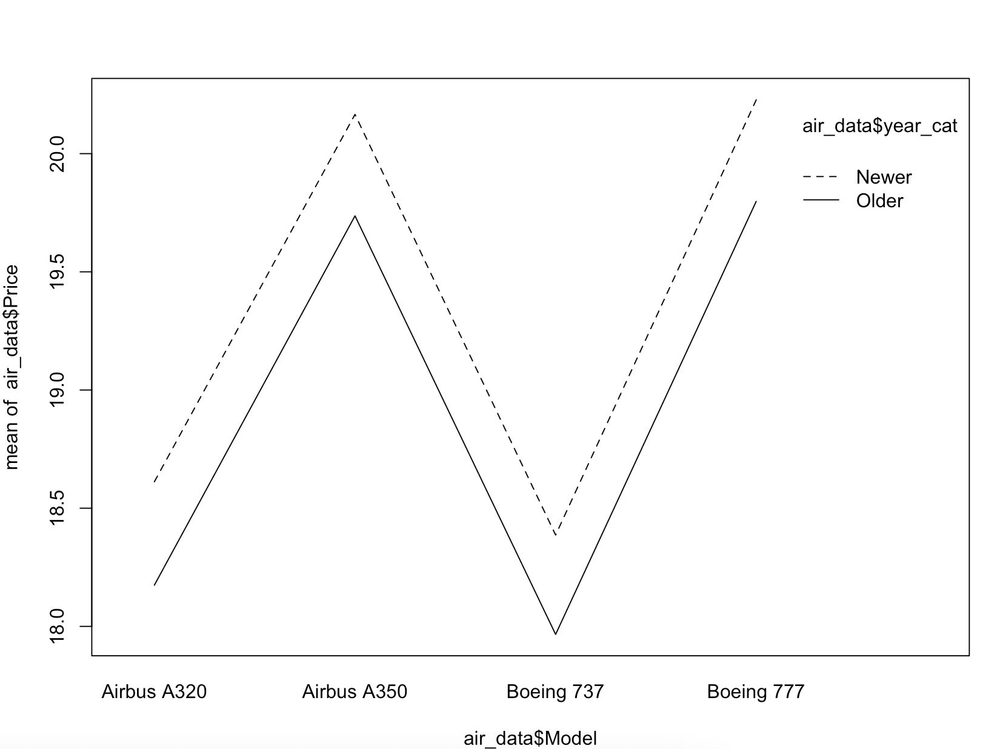

# Q2 Solutions

## Create a new data frame only including “Airbus A320”, “Airbus A350”, “Boeing 737” and “Boeing 777” models of airplanes. Check the distribution of Price: first for the observations in this sample and then for each model in the data frame. Interpret your findings.

```r
air_data <- read.csv("./data/airplane_price_dataset.csv", sep=",", stringsAsFactors=TRUE)
air_data <- air_data |>
  filter(Model %in% c("Airbus A320", "Airbus A350", "Boeing 737", "Boeing 777")) |>
  droplevels()
air_data <- air_data |>
  rename(
    FC = FuelConsumption.L.h.,
    HM = HourlyMaintenance...,
    RangeKm = Range.km.,
    Price = Price...
  )
air_data$EngineType <- as.factor(air_data$EngineType)
# Price is generally right-skewed data; a log() transformation helps to normalize the data
air_data$Price <- log(air_data$Price)
```


*Figure 01*


*Figure 02*

#### Conclusion

According to the plots, Price looks more normally distributed after applying a log() transformation and also dividing it by model.
 
 >A320 and B737 are the cheaper plane models of each company while A350 and B777 are the more expensive ones.


## Analyze the numerical variables that are affected by the “Model”. Test the assumptions of the statistical method, for the cases that you have found a significant association, by using corresponding tests and plots. Write your conclusions.


*Figure 03*

> The boxplots show that your four models fall into two sub-groups: cheaper and more expensive models.

#### Variables Affected by Model

- **Price**: The A350 and B777 (expensive sub-group) are in a different wealth bracket compared to the A320 and B737 (cheaper sub-group).
- **Capacity & RangeKm**: These are affected by the model, though there is almost zero variation within groups in the dataset. This means Model, Capacity, and RangeKm are all telling the model the same thing (high multicollinearity).

#### Assumption analysis


*Figure 04*

- The appearance of a "horizontal flat line" in the QQ-plots for **Capacity** and **RangeKm** occurs because these are likely fixed specifications for a given airplane model. Consequently, there is near-zero variance within each model group.

- For the case of **Price** the QQ-plot looks a bit curved with respect to the line meaning it might not be normally distributed. However, both Independence test and Homoscedasticity test show a p-vale > 0.05 so we are assuming Normality, Independence and Homoscedasticity.


## Apply a two-way ANOVA including Sales Region to the model. Interpret your findings.

```r
aov2_price <- aov(Price ~ Model + SalesRegion, data = air_data)
summary(aov2_price)
```


*Figure 05*

#### Conclusion

There is no significant interaction since the p-value is much higher than 0.05, we can conclude that the relationship between the aircraft Model and its Price does not change based on the Sales Region. Also, while there might be a tiny hint of a regional difference, statistically speaking, Region does not significantly affect Price.


## Convert the variable Production Year to a categorical variable with two levels as “Older” and “Newer” and save it as a new variable named “year_cat” in the data frame.

```r
cutoff = median(air_data$ProductionYear)
air_data$year_cat <- as.factor(ifelse(air_data$ProductionYear < cutoff, "Older", "Newer"))
str(air_data)
```


## Analyze the effect of Model and year (“year_cat”) together on the price. Analyze whether the interaction of two term is significant. Interpret your findings.


*Figure 06*

> This first plot aligns with previous analysis, there are two cheaper plane models and two expensive ones, and now we observe that there are older and newer models also which are a bit more expensive (shifted to the right) in each case.

```r
aov2_price <- aov(Price ~ Model * year_cat, data = air_data)
summary(aov2_price)
```


*Figure 7*


*Figure 8*

#### Conclusion

Based on the two-way ANOVA results, both the airplane Model and the categorized production year (`year_cat`) have a significant independent effect on the Price. However, the interaction between the Model and the production year is not statistically significant, indicating that the price difference between newer and older airplanes remains consistent regardless of the specific airplane model.

#### Post-hoc tests

All three post-hoc tests (Tukey, Bonferroni, and LSD) confirm significant price differences between the "cheaper" models (A320, B737) and the "expensive" models (A350, B777). However, there is likely no significant price difference *between* the two cheaper models themselves, or *between* the two expensive models. The results are consistent across the different penalty methods.
