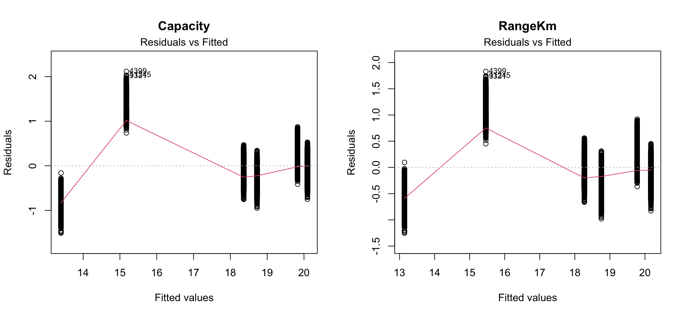
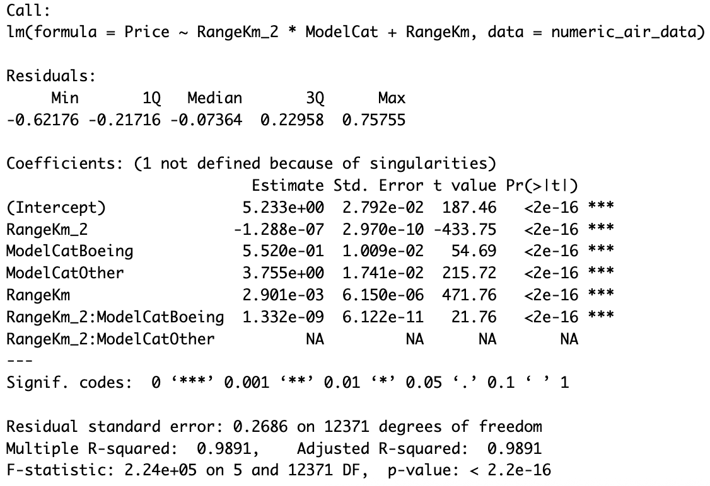
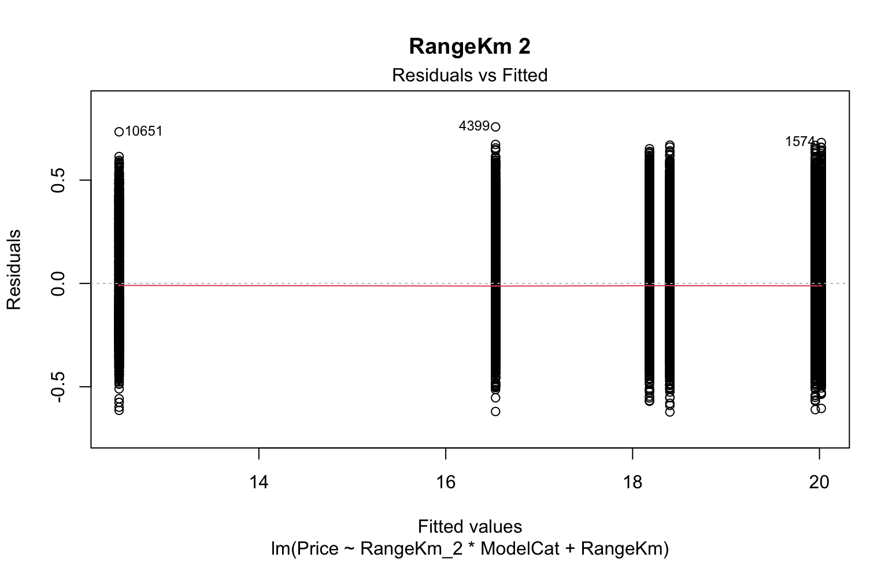
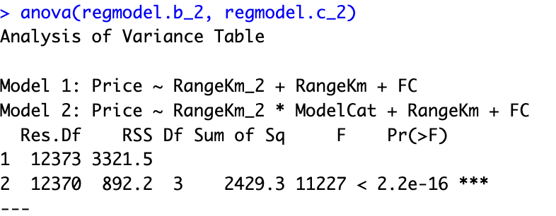
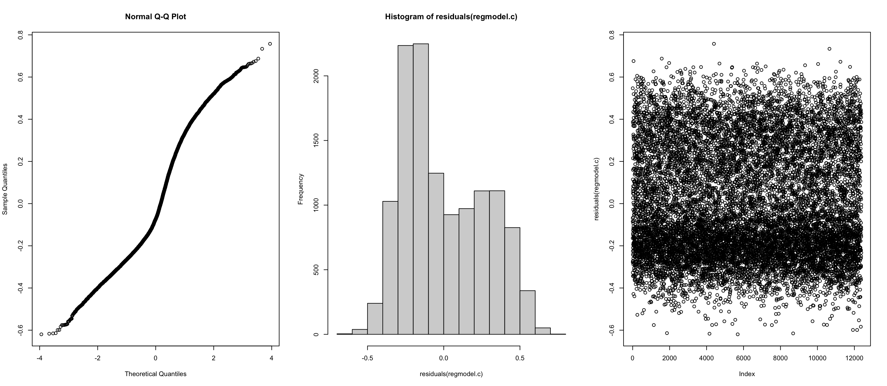
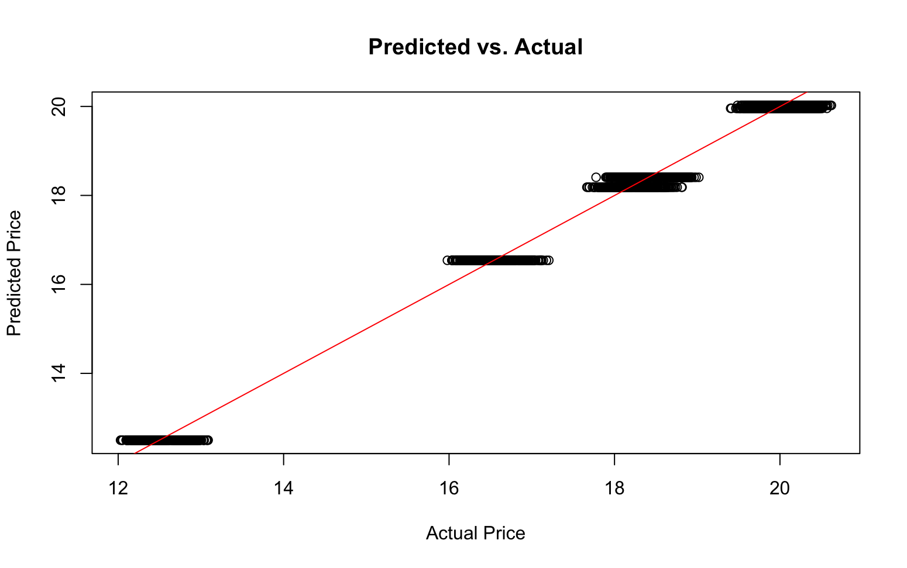

# Q3 Solutions

## Consider the numerical variables in the data set and find the best SIMPLE linear regression model to predict the prices. Test the assumptions and use transformations if it is required. Explain why the model you find is the best simple linear regression model and interpret the model coefficients.


*Figure 01*

According to plot analysis, we selected the variables `Capacity`, `RangeKm`, and `FC` (Fuel Consumption) as the best candidates for the linear model because they show the most linear relationship with `Price`. A `log()` transformation was applied to `Price` to normalize its distribution.

The correlation matrix confirmed that `Capacity`, `RangeKm`, and `FuelConsumption` are the top 3 numerical variables with the highest correlation to `Price`.


*Figure 02*

The Residual vs Fitted plots suggested that the model may need a quadratic term. After comparing `Capacity` vs `RangeKm` using a quadratic term, the ANOVA shows that `RangeKm` + `RangeKm^2` yields the lowest RSS results.


*Figure 2.1*

The new model with the quadratic term shows better residuals.


#### Regression assumptions analysis


*Figure 03*

> This model shows p-value < 0.05 on the Breusch-Pagan, meaning it has signs of heteroscedasticity.


#### Conclusion


*Figure 04*

We selected `RangeKm` (along with its quadratic transformation) as the best single predictor because it shows a high correlation with Price and explains the highest proportion of the variance in airplane prices.
- **Intercept ($\beta_0$)**: The expected log(Price) or baseline price of a plane.
- **Slope for RangeKm ($\beta_1$ & $\beta_2$)**: For each additional `RangeKm`, the log(Price) increases by $\beta_1$ and $\beta_2$, meaning Price increases exponentially by $e^{\beta_2}$


## Fit a multivariate linear regression model with the most important two (numerical) variables. Use transformations if it is needed and test all the assumptions. Then compare this model to the simple linear regression model that you fit in (a). Which one is a better model? Why? 

```r
regmodel.all <- lm(Price ~ ., data = numeric_air_data)
summary(regmodel.all)
```


*Figure 05*

First, we checked a model against all our top variables: `Capacity`, `RangeKm`, `FC`, and `Age`.

```r
regmodel.best4 <- lm(Price ~ Capacity + RangeKm + FC + Age, data = numeric_air_data)
summary(regmodel.best4)

anova(regmodel.all, regmodel.best4)
```

The ANOVA confirmed that the model with all predictors is not significantly better than the model with these 4 predictors. However, checking Variance Inflation Factors (VIF) revealed critical multicollinearity.

```r
cor(numeric_air_data[,-price.col])
vif(regmodel.best4)
```


*Figure 06*

The Correlation Matrix and VIF tell us that Capacity and RangeKm are highly correlated. VIF also tell us that there is a multicollinearity problem within our predictors. We choose to drop the predictor with the highest VIF: `Capacity`

Now, VIF shows no multicollinearity among the selected predictors.

By systematically dropping predictors and comparing via ANOVA, we discovered that keeping `RangeKm` and `FC` led to higher $R^2$ and a smaller Sum of Square Residuals. Similar to the SLR, adding a quadratic term `RangeKm^2` further improved the model.


#### Model A vs Model B comparison


*Figure 07*

- The MLR model with RangeKm + RangeKm^2 + FC has a higher adjusted R-squared and a lower residual standard error than the SLR with Capacity alone, indicating a better fit.
- The ANOVA F-test confirms that adding the second variable significantly improves the model.


#### Regression assumptions analysis


*Figure 08*


## Encode the variable model into three categories considering whether the plane is “Airbus”, “Boeing” or “Other”. Now add this model factor to the regression model you have chosen in section (b). Interpret the coefficients and overall summary of the model. Compare the model in section (b) with the model that has an additional factor. Which one would you choose? Why?

We added ModelCat to our selected model. However, introducing `ModelCat` made `FC` statistically insignificant. We dropped `FC` to simplify the model, yielding: `lm(Price ~ RangeKm_2 * ModelCat + RangeKm)`.


*Figure 09*

#### Conclusion

- Intercept ($\beta_0$): Expected log(Price) for the baseline category.
- ModelCat effects: The coefficients for Boeing and "Other" represent the shift in the baseline log(Price) compared to Airbus.
- Interaction (RangeKm_2 * ModelCat): The slope for the squared range changes depending on the airplane manufacturer.


*Figure 10*

The Residual vs Fitted plot shows good results.

#### Model B vs Model C comparison


*Figure 11*

- The ANOVA analysis tells us that adding ModelCat decreases the Residual Sum of Squares, meaning the model significantly improves with this new variable.
- We selected this interaction model (Model C) as our best model.


## Test the validity of the final model that you choose.


*Figure 12*

To fully validate the predictive power of our chosen model `(Price ~ RangeKm_2 * ModelCat + RangeKm)`, we split the data into an 80% training set and a 20% testing set.


*Figure 13*

#### Validity and Performance
- Out-of-sample MSE: We calculated the Mean Squared Error against the holdout Test Set, which quantifies the average squared prediction error on unseen data.
- Diagnostics: The Q-Q plot of the final model mostly follows the diagonal (normality holds). Durbin-Watson statistic is close to 2 (no autocorrelation).
- Plotting `Actual vs Predicted` values from the test set showed data points clustering closely around the ideal `y = x` reference line, meaning the model generalizes well and confirms our findings.
