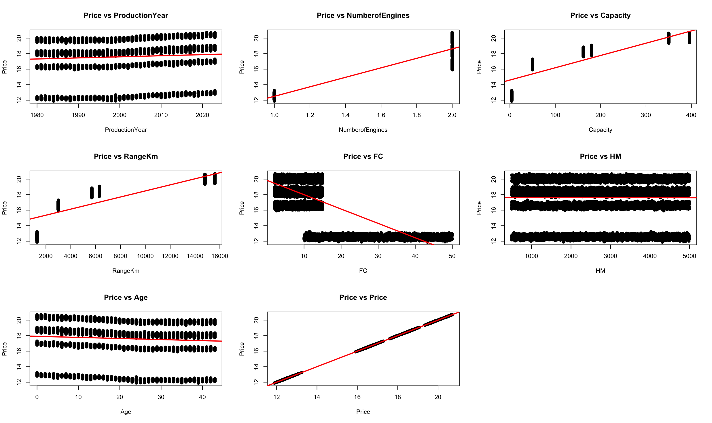
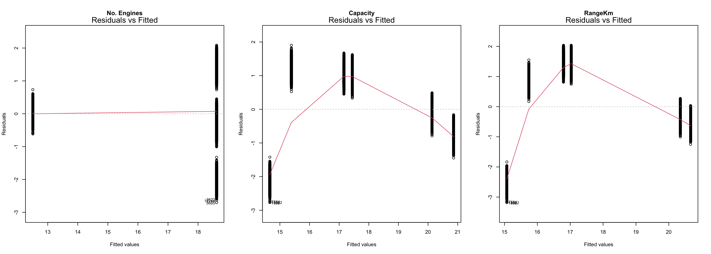
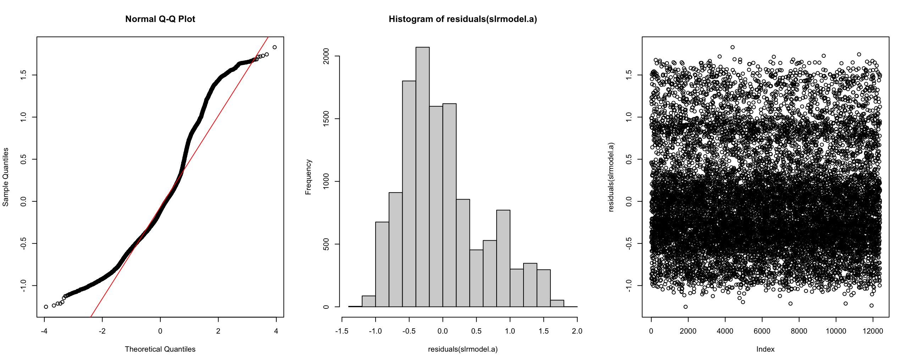
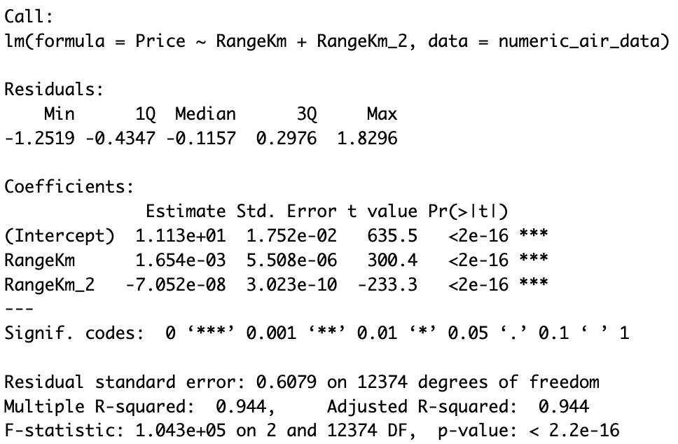
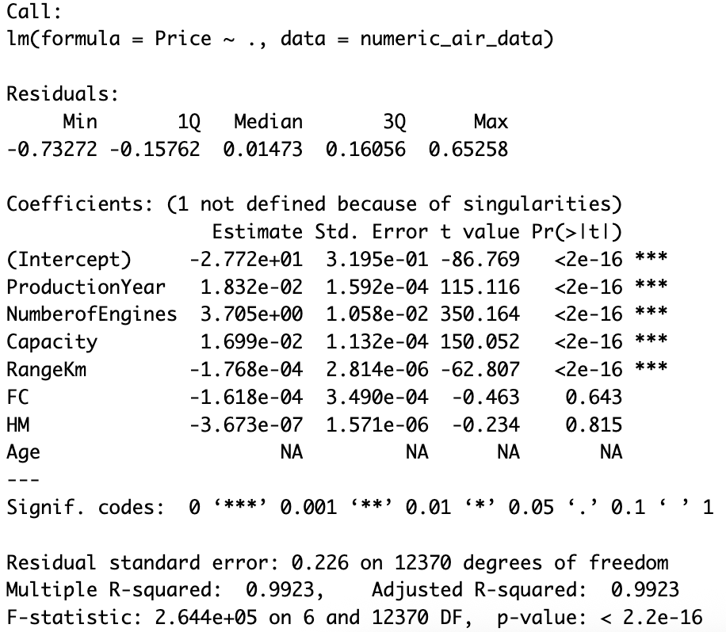
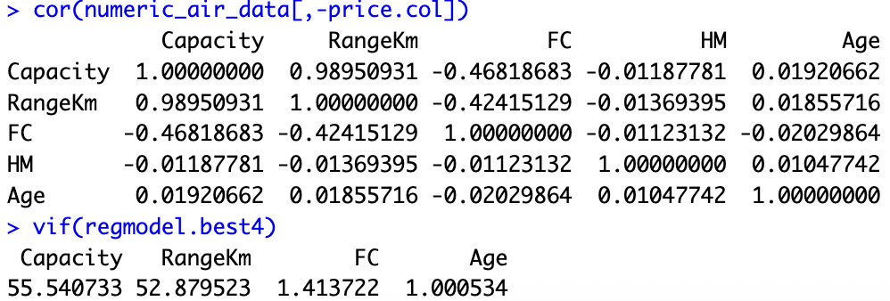
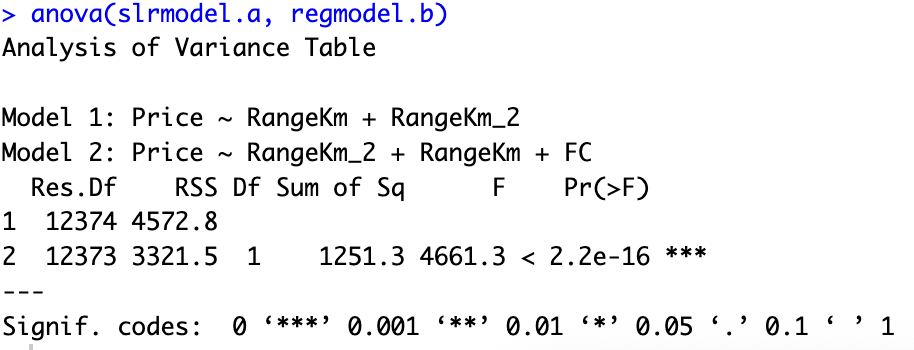
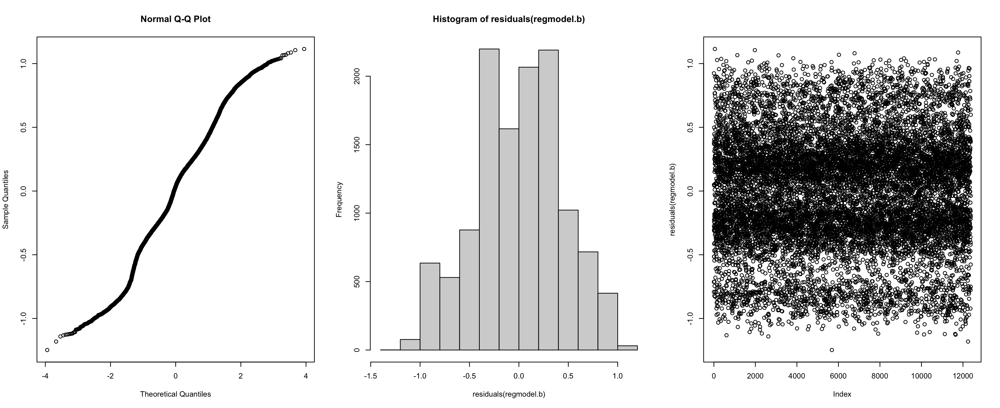
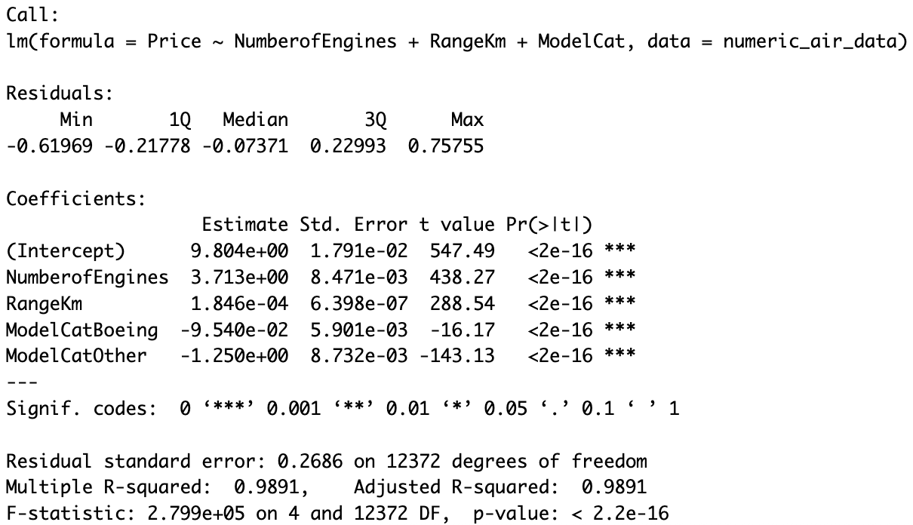
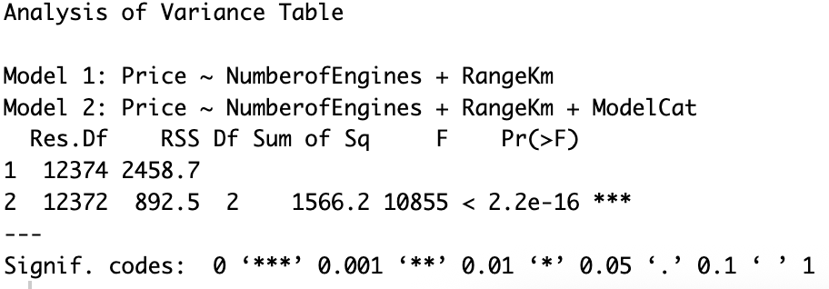

# Q3 Solutions

## Consider the numerical variables in the data set and find the best SIMPLE linear regression model to predict the prices. Test the assumptions and use transformations if it is required. Explain why the model you find is the best simple linear regression model and interpret the model coefficients.


*Figure 01*

According to plot analysis, we are selecting variables NumberOfEngines, Capacity, and RangeKm as best candidates for the linear model bc those show the most linear relationship with Price.

The correlation matrix tell us indeed that NumberofEngines, Capacity and RangeKm are the top 3 with the highest correlation to Price.


*Figure 02*

The Residual vs Fitted plots suggest that:
- NumberofEngines is showing a nearly linear relationship with Price
- In the case of Capacity and RangeKm, the model may need to include a quadratic term


#### Regression assumptions analysis


*Figure 03*

> This model shows p-value < 0.05 on the Breusch-Pagan, meaning it has signs of heteroscedasticity!!!


#### Conclusion


*Figure 04*

We have selected NumberofEngines as the best single predictor because it shows a linear high correlation vs Price and also high R-squared value, meaning it alone explains the highest proportion of the variance in airplane prices

Selecting NumberofEngines for now with R2 = 0.7792 meaning 78% of the log(Price) change can be explained by the independent variable NumberofEngines
- Intercept ($\beta_0$): Estimated baseline Price of an airplane
- Slope for NumeberofEngines ($\beta_1$): For each additional engine, the log(Price) increases by $\beta_1$, meaning Price increases exponentially by $e^{\beta_1}$


## Fit a multivariate linear regression model with the most important two (numerical) variables. Use transformations if it is needed and test all the assumptions. Then compare this model to the simple linear regression model that you fit in (a). Which one is a better model? Why? 

```r
regmodel.all <- lm(Price ~ ., data = numeric_air_data)
summary(regmodel.all)
```


*Figure 05*

The previous lm tell us that predictors NumberofEngines + Capacity + ProductionYear + RangeKm do have high significance when predicting the Price

```r
regmodel.best4 <- lm(Price ~ NumberofEngines + Capacity + ProductionYear + RangeKm, data = numeric_air_data)
summary(regmodel.best4)

anova(regmodel.all, regmodel.best4)
```

The ANOVA confirms that model with all of the predictors is not significantly better than the model with the 4 predictors

```r
cor(numeric_air_data[,-price.col])
vif(regmodel.best4)
```


*Figure 06*

The Correlation Matrix and VIF tell us that Capacity and RangeKm are highly correlated. VIF also tell us that there is a multicollinearity problem within our predictors. We choose to drop the predictor with the highest VIF: Capacity

```r
regmodel.best3 <- lm(Price ~ NumberofEngines + ProductionYear + RangeKm, data = numeric_air_data)
summary(regmodel.best3)
vif(regmodel.best3)
```

Now, VIF shows no multicollinearity among the selected predictors.

```r
regmodel.b1 <- lm(Price ~ NumberofEngines + ProductionYear, data = numeric_air_data)
summary(regmodel.b1)
regmodel.b2 <- lm(Price ~ NumberofEngines + RangeKm, data = numeric_air_data)
summary(regmodel.b2)

anova(regmodel.best3, regmodel.b1)  # Drop RangeKm predictor
anova(regmodel.best3, regmodel.b2)  # Drop ProductionYear predictor
```

After comparing both models, dropping each extra predictor, we observe that keeping RangeKm predictor leads to higher R2 (prediction power) and a smaller Sum of Square Residuals. So, we decided to choose NumberofEngines + RangeKm


#### Model A vs Model B comparison


*Figure 07*

- The MLR model with NumberOfEngines + RangeKm do have a higher adjusted R-squared and lower AIC than the SLR with NumberOfEngines alone, indicating a better fit. 
- The ANOVA F-test tells us whether adding the second variable significantly improves the model.


#### Regression assumptions analysis


*Figure 08*

> This model also shows p-value < 0.05 on the Breusch-Pagan, meaning it has signs of heteroscedasticity!!!


## Encode the variable model into three categories considering whether the plane is “Airbus”, “Boeing” or “Other”. Now add this model factor to the regression model you have chosen in section (b). Interpret the coefficients and overall summary of the model. Compare the model in section (b) with the model that has an additional factor. Which one would you choose? Why?


*Figure 09*

#### Conclusion

- Intercept ($\beta_0$): Estimated baseline Price of an airplane
- Slope for NumeberofEngines ($\beta_1$): For each additional engine, the log(Price) increases by $\beta_1$, meaning Price increases exponentially by $e^{\beta_1}$
- Slope for RangeKm ($\beta_2$): For each additional RangeKm, the log(Price) increases by $\beta_2$, meaning Price increases exponentially by $e^{\beta_2}$

#### TODO: interpret coefficients and model
- add residual vs fitted
- put coefficients as CI (not point estimations)


#### Model B vs Model C comparison


*Figure 10*

- The ANOVA analysis, tell us that adding ModelCat to the model decreases the Residual Sum of Squares, meaning the model improves with this new variable.
- Also, this new model passes the Breusch-Pagan tests meaning it shows homoscedasticity, which make it good for linear regression.

We decided to select model C as out best model.


## Test the validity of the final model that you choose.


*Figure 11*

#### Our final model C:
- Q-Q plot follows the diagonal (normality holds).
- Breusch-Pagan p > 0.05 (constant variance / homoscedasticity holds).
- Durbin-Watson statistic is close to 2 (no autocorrelation).
- All VIF values < 5 (no severe multicollinearity).
