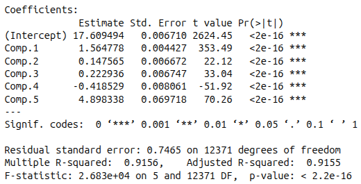
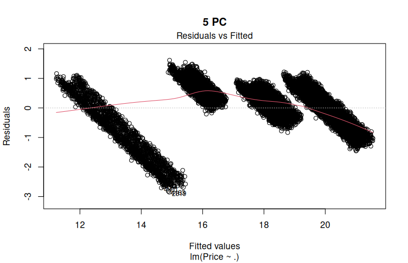
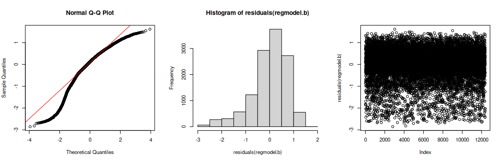

# Q4 Solutions

## Apply PCA analysis on airplane data and interpret the results of the analysis.

We applied a log transformation to the Price variable, consistent with the methodology in Q3, even though it was not utilized directly as an input for the PCA.

To ensure a robust analysis, we performed the PCA using two functions: princomp() and PCA(). Both methods yielded identical results, identifying five principal components based on the calculated eigenvalues.

  
*Figure 1*

*Figure 2*

### Discussion of Variance and Selection Criteria

As shown in Figure 1, Principal Component 1 (PC1) accounts for 45.95% of the total variance, while PC2 and PC3 explain approximately 20% each. To determine the optimal number of components to retain, we evaluated three standard criteria:

- 80% Variance Rule: To capture at least 80% of the information, we must retain the first three components, which collectively explain 85.96% of the total variation.

- Kaiser’s Rule: While PC1 and PC2 strictly meet this requirement, PC3 is a borderline case with an eigenvalue of 0.989 (see Figure 1). Given how close this value is to 1, retaining PC3 is statistically justifiable to meet our variance threshold.

- Elbow Rule: If we were to strictly follow the "elbow" or bend in the scree plot (see Figure 2), the most significant drop occurs after PC1.

Balancing these methods, we would retain the first three components to ensure a comprehensive representation of the dataset’s variance.

*Figure 3*

*Figure 4*

*Figure 5*

### Interpretation of components

Figure 3 provides a biplot that includes the individual observations. We can observe that the data points are spread across the first two components, clearly forming four distinct clusters.

In Figure 5, we included Price as a supplementary variable (indicated by the blue dashed line). While Price was not used to calculate the principal components to avoid biasing the model, it is highly correlated with the first dimension. Specifically, it aligns closely with Capacity and RangeKm, confirming that higher-capacity, longer-range vehicles tend to have a higher price point, while being inversely related to FuelConsumption (FC).

The first dimension captures the scale and performance of the aircraft, and seems to be the primary driver of Price. While the second dimension could represent the operational lifecycle of the airplane. Because the second dimension is orthogonal to the price, price is not affected by the operational lifecycle, age and Hourly Maintainance (HM).

- Top-Right: Large, high-range planes that are older and expensive to maintain.

- Bottom-Right: Large, modern, high-range planes with relatively lower maintenance needs.

- Top-Left: Small, fuel-efficient planes that are older and need a lot of work.

- Bottom-Left: Small, modern, highly efficient planes (the entry-level newer models).

### Assumptions

  
*Figure 6*

  
*Figure 7*

  
*Figure 8*

- KMO Test (Figure 6): The overall KMO value is 0.533, which is below 0.6. Notably, Age shows the highest individual adequacy at 0.824.

- Bartlett’s Test (Figure 7): Our result shows a p-value of 0 ($p < 0.05$), confirming that the variables are sufficiently related to justify PCA.

- Linearity (Figure 8): PCA assumes linear relationships between variables. The scatterplot matrix confirms a strong linear trend between Capacity and RangeKm, though relationships with other variables are less defined.

## Find the best linear model to predict price on the principal components. Do not forget to test the assumptions and the validity of the model.

  
*Figure 9*

*Figure 10*

After doing an ANOVA analysis and AIC with four components subtracting each of the component per try, we conclude that the best linear regression model is to take into account the five principle components even component 2 is the less significant, could be seen with orthogonality to price in PCA. Also in the model coefficients, Figure 9 we can see that the p-vlaue is very low for each component so removing one component of from the model could reduce performance. The Figure 10 shows a parabolic curve so it might suggest that there are quadratic relations between variables and price.

We don't need to test collinearity with vif() beacuse components are orthogonal between them (no correlation).

#### Assumptions

*Figure 11*

- Normality (Figure 11 first and second plot): The histogram and Q-Q plot indicate that the residuals are generally normal but moderately left-skewed. While not a perfect bell curve, the large sample size invokes the Central Limit Theorem.

- Homoscedastacity (Figure 11 third plot): Although the Breusch-Pagan test suggests heteroscedasticity due to its extreme sensitivity to large samples, the Residuals vs Index plot shows a consistent spread across the entire range. We conclude the variance is sufficiently constant

- Independence of errors: The Durbin-Watson test yielded a p-value of 0.4562, failing to reject the null hypothesis of no autocorrelation.

## Would you prefer the linear model that you fit in the final step of question 3 or this one? Explain why.

We prefer the Multiple Linear Regression (MLR) model from Question 3 over the Principal Component Regression (PCR) model. Although the MLR model utilizes six variables, because of the interaction of Model and RangeKm, compared to the five underlying the PCA components, it demonstrates superior performance across all key metrics. Specifically, the MLR model achieves a higher Adjusted $R^2$ and a lower Residual Standard Error, indicating a tighter fit to the data. 

The most compelling evidence lies in the Mean Squared Error (MSE) results. The MLR model produced an MSE of 0.07, significantly lower than the 0.53 observed in the PCA model. This indicates that the MLR model is substantially more precise at predicting airplanes prices, justifying the slight increase in model complexity.