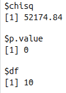
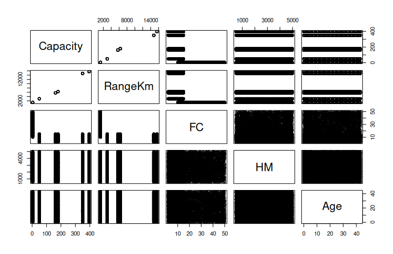
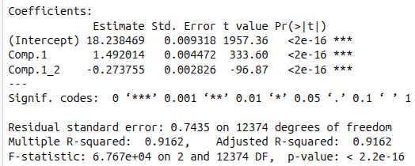
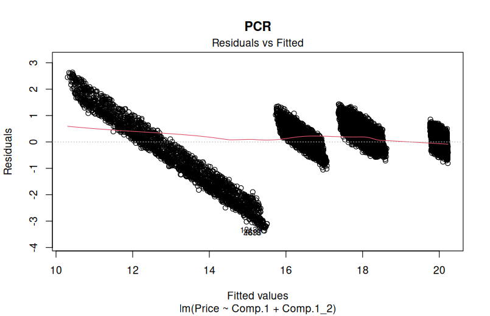
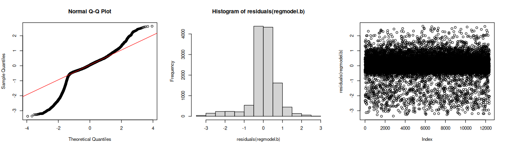
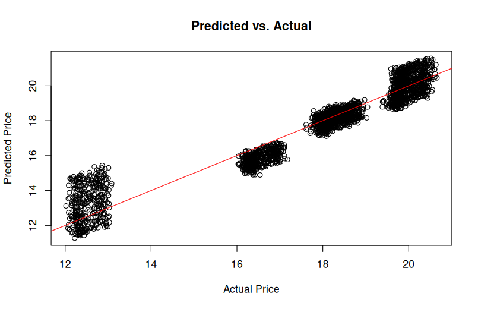

# Q4 Solutions

## Apply PCA analysis on airplane data and interpret the results of the analysis.

We applied a log transformation to the Price variable, consistent with the methodology in Q3, even though it was not utilized directly as an input for the PCA.

To ensure a robust analysis, we performed the PCA using two functions: princomp() and PCA(). Both methods yielded identical results, identifying five principal components based on the calculated eigenvalues.

  
*Figure 1*

*Figure 2*

### Discussion of Variance and Selection Criteria

As shown in Figure 1, Principal Component 1 (PC1) accounts for 45.95% of the total variance, while PC2 and PC3 explain approximately 20% each. To determine the optimal number of components to retain, we evaluated three standard criteria:

- 80% Variance Rule: To capture at least 80% of the information, we must retain the first three components, which collectively explain 85.96% of the total variation.

- Kaiser’s Rule: While PC1 and PC2 strictly meet this requirement, PC3 is a borderline case with an eigenvalue of 0.989 (see Figure 1). Given how close this value is to 1, retaining PC3 is statistically justifiable to meet our variance threshold.

- Elbow Rule: If we were to strictly follow the "elbow" or bend in the scree plot (see Figure 2), the most significant drop occurs after PC1.

Balancing these methods, we would retain the first three components to ensure a comprehensive representation of the dataset’s variance.

*Figure 3*

*Figure 4*

*Figure 5*

### Interpretation of components

Figure 3 provides a biplot that includes the individual observations. We can observe that the data points are spread across the first two components, clearly forming four distinct clusters.

In Figure 5, we included Price as a supplementary variable (indicated by the blue dashed line). While Price was not used to calculate the principal components to avoid biasing the model, it is highly correlated with the first dimension. Specifically, it aligns closely with Capacity and RangeKm, confirming that higher-capacity, longer-range vehicles tend to have a higher price point, while being inversely related to FuelConsumption (FC).

The first dimension captures the scale and performance of the aircraft, and seems to be the primary driver of Price. While the second dimension could represent the operational lifecycle of the airplane. Because the second dimension is orthogonal to the price, price is not affected by the operational lifecycle, age and Hourly Maintainance (HM).

### Interpretation of quadrants

- Top-Right: Large, high-range planes that are older and expensive to maintain.

- Bottom-Right: Large, modern, high-range planes with relatively lower maintenance needs.

- Top-Left: Small, fuel-efficient planes that are older and need a lot of work.

- Bottom-Left: Small, modern, highly efficient planes (the entry-level newer models).

### Assumptions

  
*Figure 6*

  
*Figure 7*

  
*Figure 8*

- KMO Test (Figure 6): The overall KMO value is 0.533, which is below 0.6. Notably, Age shows the highest individual adequacy at 0.824.

- Bartlett’s Test (Figure 7): Our result shows a p-value of 0 ($p < 0.05$), confirming that the variables are sufficiently related to justify PCA.

- Linearity (Figure 8): PCA assumes linear relationships between variables. The scatterplot matrix confirms a strong linear trend between Capacity and RangeKm, though relationships with other variables are less defined.

## Find the best linear model to predict price on the principal components. Do not forget to test the assumptions and the validity of the model.

  
*Figure 9*

*Figure 10*

We evaluated several Principal Component Regression (PCR) specifications, concluding that the quadratic model (Figure 9) offers the most balanced performance.

Initially, we fitted a simple linear regression using only the first principal component (PC1), which captures the primary variance in Price (as shown in the Correlation Circle, Figure 5). While initial results were promising, the Residuals vs. Fitted plot revealed a distinct parabolic trend, signaling a violation of the linearity assumption. To address this, we introduced a quadratic term ($PC1^2$), which resulted in a substantial improvement in model fit (Figure 10). Both ANOVA (Partial F-test) and AIC comparisons statistically confirmed that the inclusion of the squared term was necessary to capture the non-linear relationship.

Regarding the remaining components, we opted to exclude PC2 and PC3. PC2 is orthogonal to Price, offering no predictive power, while PC3 was primarily defined by Age and Hourly Maintenance (HM), variables which, in this specific dataset, showed weak correlation with the target. Even adding PC4 (mainly representing Fuel Consumption) showed some improvement in AIC, we ultimately chose to exclude it to prioritize model simplicity. By maintaining a simpler model, we reduce the risk of overfitting and ensure that the regression remains interpretable and generalizes effectively to new, out-of-sample data. PC5 was not utilized because of its low explanation in variance.

We don't need to test collinearity with vif() because components are orthogonal between them (no correlation) and there is no linear association between a variable and its squared.

#### Assumptions

*Figure 11*

- Normality (Figure 11 first and second plot): The histogram and Q-Q plot indicate that the residuals are generally normal but moderately left-skewed. While not a perfect bell curve, the large sample size invokes the Central Limit Theorem.

- Homoscedastacity (Figure 11 third plot): Although the Breusch-Pagan test suggests heteroscedasticity due to its extreme sensitivity to large samples, the Residuals vs Index plot shows a consistent spread across the entire range. We conclude the variance is sufficiently constant

- Independence of errors: The Durbin-Watson test yielded a p-value of 0.4675, failing to reject the null hypothesis of no autocorrelation.

### Validity

*Figure 11*

We performed a validation using an 80/20 train-test split. Figure 11 displays the relationship between the Actual Prices in the test set and the Prices Predicted by the model.

The model achieved a Mean Squared Error (MSE) of 0.53. While there is visible dispersion, this is a respectable result considering the model’s simplicity. It relies on only two predictors (the first principal component and its quadratic term) to explain the majority of the price variation.

As seen in the plot, the observations are clustered into four distinct groups, maybe because of airplanes models.

## Would you prefer the linear model that you fit in the final step of question 3 or this one? Explain why.

We prefer the Multiple Linear Regression (MLR) model from Question 3. While the Principal Component Regression (PCR) model is efficient using only two predictors ($PC1$ and $PC1^2$) to explain the data, the MLR model provides a much higher level of precision.

The performance gap is most evident in the Mean Squared Error (MSE). The MLR model achieved an MSE of 0.071, whereas the PCR model produced a significantly higher error of 0.527. 

Although the MLR model introduces more complexity by using six variables (including the interaction between Model and RangeKm) and is very probably overfitting, in this case, we prioritize predictive accuracy over simplicity of the PCR model.

The only case we will prefer the PCR model is in case we have to predict Prices of airplanes from out-of-sample data and the airplane does not belong to a model in the trained dataset.