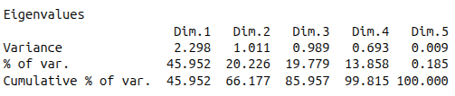
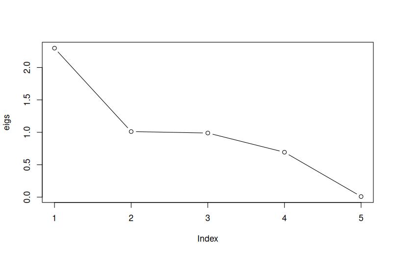
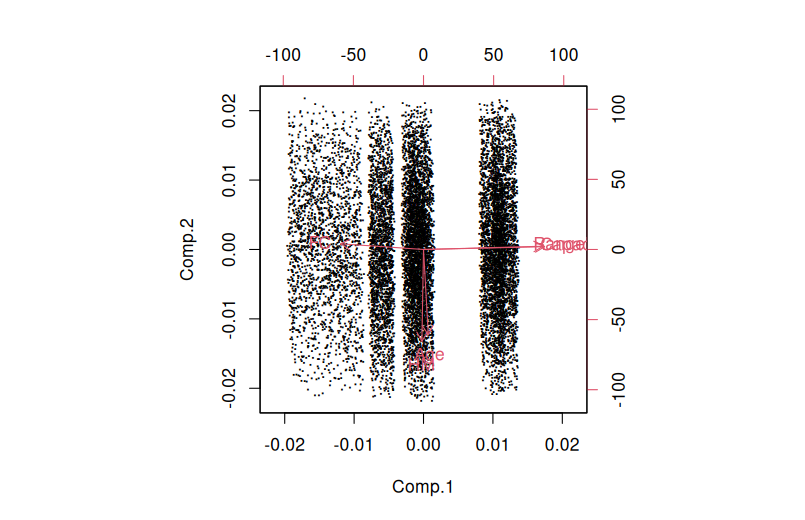
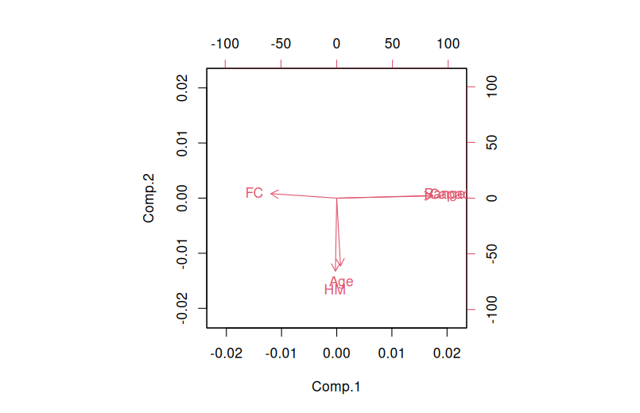
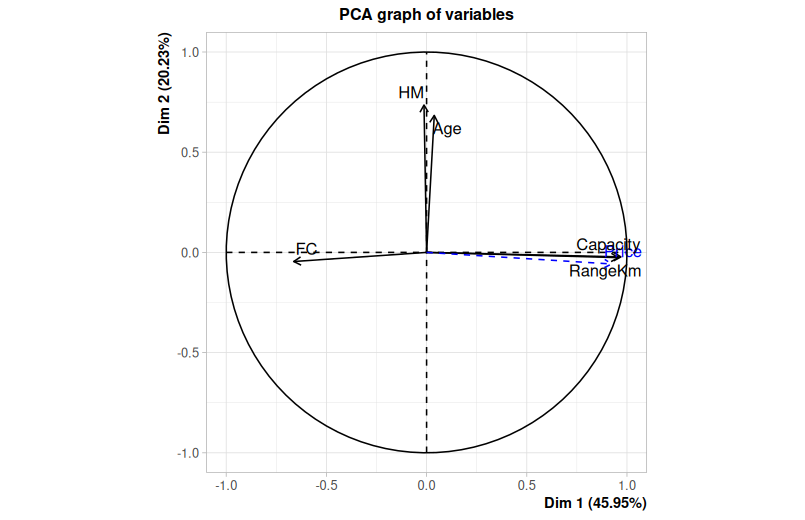
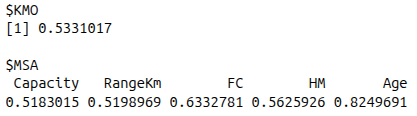

# Q4 Solutions

## Apply PCA analysis on airplane data and interpret the results of the analysis.

We applied a log transformation to the Price variable, consistent with the methodology in Q3, even though it was not utilized directly as an input for the PCA.

To ensure a robust analysis, we performed the PCA using two functions: princomp() and PCA(). Both methods yielded identical results, identifying five principal components based on the calculated eigenvalues.

  
*Figure 1*

*Figure 2*

### Discussion of Variance and Selection Criteria

As shown in Figure 1, Principal Component 1 (PC1) accounts for 45.95% of the total variance, while PC2 and PC3 explain approximately 20% each. To determine the optimal number of components to retain, we evaluated three standard criteria:

- 80% Variance Rule: To capture at least 80% of the information, we must retain the first three components, which collectively explain 85.96% of the total variation.

- Kaiser’s Rule: While PC1 and PC2 strictly meet this requirement, PC3 is a borderline case with an eigenvalue of 0.989 (see Figure 1). Given how close this value is to 1, retaining PC3 is statistically justifiable to meet our variance threshold.

- Elbow Rule: If we were to strictly follow the "elbow" or bend in the scree plot (see Figure 2), the most significant drop occurs after PC1.

Balancing these methods, we have elected to retain the first three components to ensure a comprehensive representation of the dataset’s variance.

*Figure 3*

*Figure 4*

*Figure 5*

### Interpretation of components

Figure 3 provides a biplot that includes the individual observations. We can observe that the data points are spread across the first two components, clearly forming four distinct clusters.

In Figure 5, we included Price as a supplementary variable (indicated by the blue dashed line). While Price was not used to calculate the principal components to avoid biasing the model, it is highly correlated with the first dimension. Specifically, it aligns closely with Capacity and RangeKm, confirming that higher-capacity, longer-range vehicles tend to have a higher price point, while being inversely related to FC.

### Technical Differences in Visualization

**Biplots** (Figures 4 & 5): Figure 3 display both the observations and the variable vectors while in Figure 4 observations were removed for better visualization of variables. The axes are scaled based on the principal component scores (calculated via eigenvectors). 

**Correlation Circle** (Figure 5): Unlike the biplot, this plot standardizes the variables within a unit circle. The length and direction of the arrows represent the correlation coefficients between the variables and the dimensions. This is the most effective tool for observing how variables relate to one another and to the underlying components.

### Assumptions

#### Kaiser-Meyer-Olkin (KMO) Test

  
*Figure 04*

#### Bartlett’s test of sphericity

## Find the best linear model to predict price on the principal components. Do not forget to test the assumptions and the validity of the model.

*Figure 04*

#### Model 3 PC vs Model 2 PC comparison

*Figure 05*

After doing an ANOVA analysis with a linear model with 3 PC vs 2PC, it confirms that model with the first 3 PC is not significantly better than the model with 2 PC. We decided to select only the top 2 most important PC for our model.

#### Regression assumptions analysis

*Figure 06*

> This model shows p-value < 0.05 on the Breusch-Pagan, meaning it has signs of heteroscedasticity. Also now, the Durbin-Watson test on the PCA model shows significance (autocorrelation).

#### Conclusion

The previous linear model tell us that the first 3 PC do have high significance when predicting the Price. This alligns with the model selected in **Q3** as PC1 is influenced by NumberofEngines, Capacity, and RangeKm, and PC2 is dominated by ProductionYear and Age.

## Would you prefer the linear model that you fit in the final step of question 3 or this one? Explain why.

*Figure 07*

- **Prediction Power**: Both models have similar prediction power R2. We prefered the **Q3** model because it has lower RSS.
- **Interpretability**: Q3 model uses original variables (Capacity, RangeKm, Manufacturer) which are directly interpretable. PCA model uses abstract components that are harder to explain to stakeholders.
- **Assumption violations**: Also the PCA model shows significant autocorrelation and heteroscedasticity.
