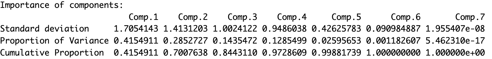
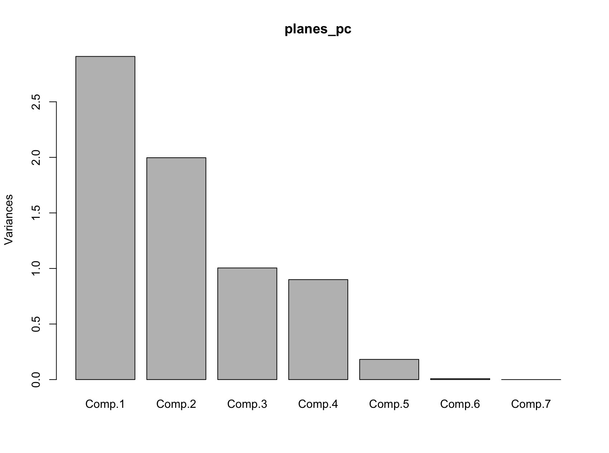
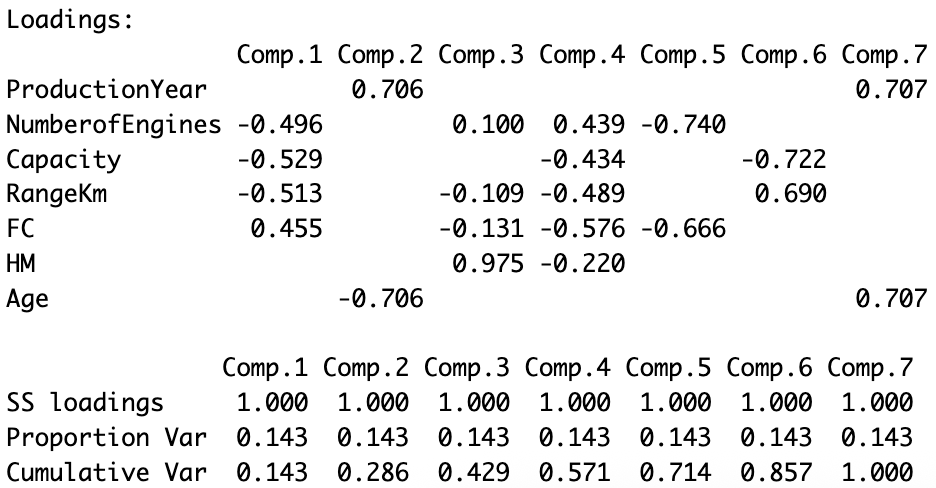
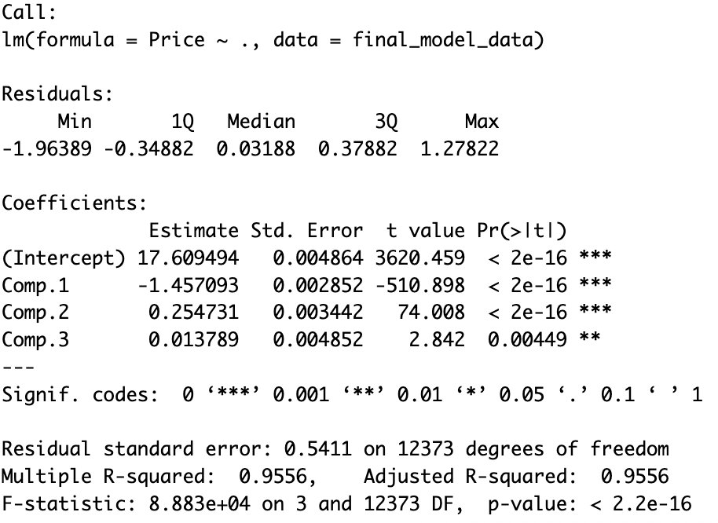
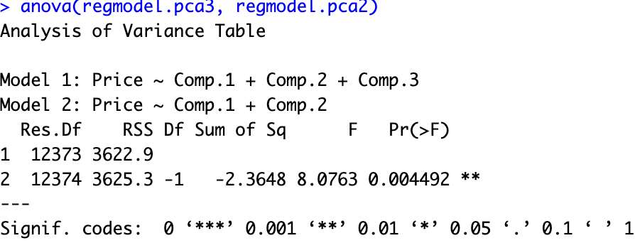
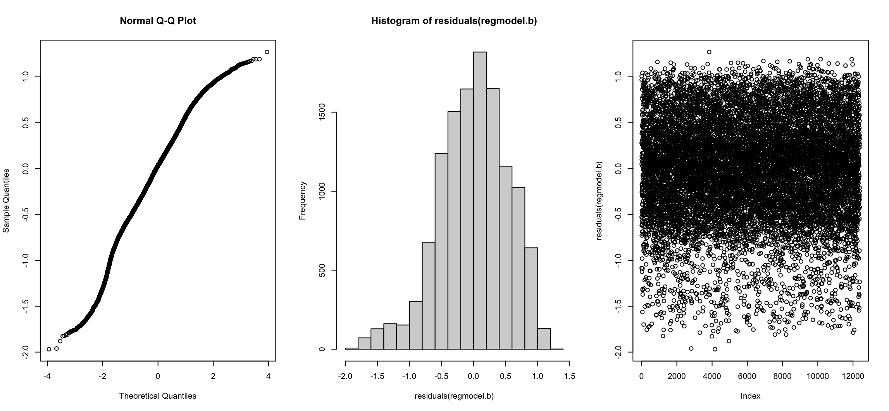
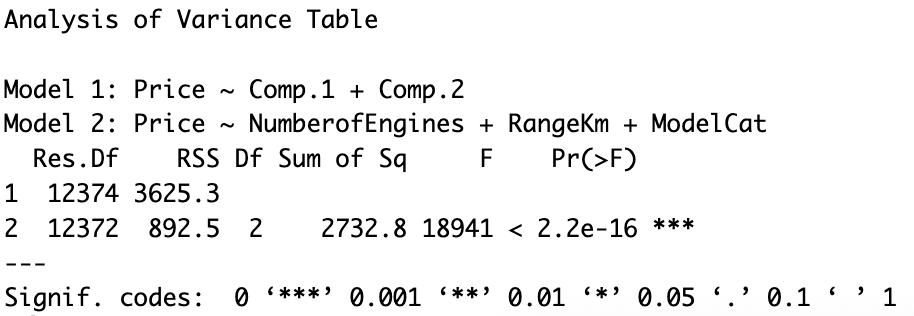

# Q4 Solutions

## Apply PCA analysis on airplane data and interpret the results of the analysis.


*Figure 01*


*Figure 02*


*Figure 03*

#### Conclusion

- **PC1**: This component is heavily influenced by NumberofEngines (-0.496), Capacity (-0.529), and RangeKm (-0.513). It captures the size and performance of the planes. Since these are all negative, a "low" score on PC1 actually represents a large, powerful plane with many engines and high capacity.
- **PC2**: This is dominated by ProductionYear (0.706) and Age (-0.706). Since Year and Age are opposites, this component perfectly captures the "newness" of the plane. High values for PC2 mean a newer asset (higher year, lower age).
- **PC3**: This component is almost entirely HM (0.975). This is saying that the Price increases with more Maintainance Hours.

The output of the PCA and the plot show that the first three components account for the ~85 percent of the data variation and also have eigenvalues > 1. We decided to choose the **three most important components** for the analysis.


## Find the best linear model to predict price on the principal components. Do not forget to test the assumptions and the validity of the model.

```r
pca_data <- as.data.frame(planes_pc$scores[, 1:3])
final_model_data <- cbind(Price = air_data$Price, pca_data)
regmodel.pca <- lm(Price ~ ., data = final_model_data)
summary(regmodel.pca)
```


*Figure 04*

#### Model 3 PC vs Model 2 PC comparison


*Figure 05*

After doing an ANOVA analysis with a linear model with 3 PC vs 2PC, it confirms that model with the first 3 PC is not significantly better than the model with 2 PC. We decided to select only the top 2 most important PC for our model.

#### Regression assumptions analysis


*Figure 06*

> This model shows p-value < 0.05 on the Breusch-Pagan, meaning it has signs of heteroscedasticity. Also now, the Durbin-Watson test on the PCA model shows significance (autocorrelation).

#### Conclusion

The previous linear model tell us that the first 3 PC do have high significance when predicting the Price. This alligns with the model selected in **Q3** as PC1 is influenced by NumberofEngines, Capacity, and RangeKm, and PC2 is dominated by ProductionYear and Age.


## Would you prefer the linear model that you fit in the final step of question 3 or this one? Explain why.


*Figure 07*

- **Prediction Power**: Both models have similar prediction power R2. We prefered the **Q3** model because it has lower RSS.
- **Interpretability**: Q3 model uses original variables (Capacity, RangeKm, Manufacturer) which are directly interpretable. PCA model uses abstract components that are harder to explain to stakeholders.
- **Assumption violations**: Also the PCA model shows significant autocorrelation and heteroscedasticity.
